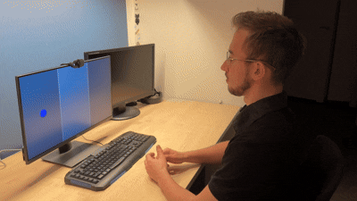
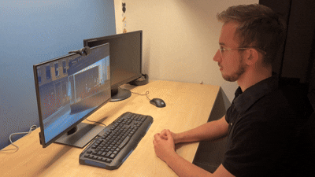

# Eye tracking demo app
This is a project demonstrating the performance of face-landmark-only trained models in eye tracking classification task. 

Demo consits of 2 modes:
- *Evaluation mode*: created for testing model's performance and accuracy;
 
- *Gallery mode*: enables users to browse through photos placed in **Gallery** folder, feel free to add and browse your own photos.
 

 The repository has been set up to enable usage on different hardware.
- The **main** branch assumes a device with Nvidia GPU, since it uses CUDA to accelerate model's inference.
- The **laptop** branch is suited for systems without dedicated Nvidia GPU.
- The app has been also proven to work on Raspberry Pi 4b, to test it make sure to follow the instructions placed in a README file on **rpi** branch.
## Requirements 
- Ubuntu 22.04 or newer
- Web camera

## Running with Docker

You can run this application in an isolated Docker container. This is primarily supported only on Linux systems.

**1. Build the Docker Image:**
```bash
docker build -t et-demo .
```

**2. Allow Local GUI Access:**
In order for the OpenCV window inside the container to display on your local screen, allow Docker to connect to your X11 display server:
```bash
xhost +local:docker
```

**3. Run the Container:**
```bash
docker run -it --rm \
  --device=/dev/video0:/dev/video0 \
  -e DISPLAY=$DISPLAY \
  -v /tmp/.X11-unix:/tmp/.X11-unix \
  et-demo
```
*(Note: You might need to add `sudo` before `docker` depending on your user group settings).*

## Local Setup 
The project uses poetry dependency managment, to install locally:
```
curl -sSL https://install.python-poetry.org | python -
```
To install dependencies and create the environment: 

```
poetry install
```

Then run it using: 

```
poetry shell
```

To run the application:

```
poetry run python3  src/main.py
```

